# 🌎 Latinoamérica Comparte

**Documentación Técnica — Proyecto Integrador**  
`Spring Boot` · `Thymeleaf` · `PostgreSQL` · `JavaScript`  
Versión 2.0 — Mayo 2026 | Autor: Dev.jhoserbriceno · Dev.johanjurado

---

## 📌 URL del Repositorio

🔗 [https://github.com/Jhoser1801/Proyecto_Desarrollo_Empresarial](https://github.com/Jhoser1801/Proyecto_Desarrollo_Empresarial)

---

## 📝 Descripción del Proyecto

**Latinoamérica Comparte** es una plataforma web institucional desarrollada para la Fundación "Latinoamérica Comparte", organización que busca expandir el modelo de éxito de *Colombia Comparte* hacia Ecuador, Chile y Argentina.

El sistema soluciona la necesidad de una **presencia digital estandarizada y adaptable** para cada país, permitiendo a los administradores gestionar de forma segura y centralizada el contenido dinámico del portal: noticias, testimonios de éxito y solicitudes de contacto de los visitantes.

**¿A quién está dirigido?**
- **Visitantes públicos:** ciudadanos interesados en los programas de la Fundación que pueden leer noticias, ver testimonios y enviar solicitudes de contacto.
- **Administradores:** personal de la Fundación que gestiona todos los contenidos del portal desde un panel protegido.

**Funcionalidades principales:**
- Gestión completa (CRUD) de noticias con estados Publicado/Borrador
- Gestión completa de testimonios con miniaturas automáticas de YouTube
- Recepción y administración de solicitudes de contacto del público
- Panel de administración con métricas, gráfica mensual y tabla de últimas solicitudes
- Autenticación segura con Spring Security y contraseñas cifradas con BCrypt

---

## 🚀 Pasos para Correr el Proyecto

### Prerrequisitos

- **Java 21** (JDK) — [Descargar eclipse-temurin 21](https://adoptium.net/)
- **Gradle 8.7** — o usar el wrapper `gradlew` incluido en el proyecto (recomendado)
- **PostgreSQL 16** corriendo en `localhost:5432`
- **IDE recomendado:** IntelliJ IDEA (importar como proyecto Gradle)

### Paso 1: Clonar el repositorio

```bash
git clone https://github.com/Jhoser1801/Proyecto_Desarrollo_Empresarial.git
cd Proyecto_Desarrollo_Empresarial
```

### Paso 2: Crear la base de datos

Conectarse a PostgreSQL y ejecutar:

```sql
CREATE DATABASE latinoamerica_comparte_integrador;
```

### Paso 3: Configurar variables de entorno locales

El archivo `application.properties` no contiene credenciales hardcodeadas. Crear el archivo:

```
src/main/resources/application-local.properties
```

Con el siguiente contenido (ajustar los valores):

```properties
DATABASE_URL=jdbc:postgresql://localhost:5432/latinoamerica_comparte_integrador
DATABASE_USERNAME=postgres
DATABASE_PASSWORD=tu_contrasena
ADMIN_EMAIL=admin@comparte.com
ADMIN_PASSWORD=tu_contrasena_admin
```

> ⚠️ `application-local.properties` está en `.gitignore` y nunca se sube al repositorio. Cada desarrollador debe crearlo manualmente.

### Paso 4: Ejecutar el proyecto

**Opción A — IntelliJ IDEA (recomendado)**

1. Abrir el proyecto en IntelliJ IDEA como proyecto Gradle
2. Navegar a `src/main/java/dev/jhoserbriceno/latinoamerica/LatinoamericaComparteApplication.java`
3. Hacer clic en el botón ▶️ que aparece en la parte superior del editor
4. El servidor arranca automáticamente

**Opción B — Terminal (Gradle wrapper)**

```bash
# Linux / Mac
./gradlew bootRun

# Windows
gradlew.bat bootRun
```

### Paso 5: Acceder al sistema

Abrir en el navegador: [http://localhost:8081](http://localhost:8081)

El administrador inicial se crea automáticamente por `DataSeed.java` si no existe ninguno en la base de datos.

### Credenciales de prueba

| 🗄️ Base de datos | 🔐 Panel Admin |
|---|---|
| **Host:** `localhost:5432` | **Email:** `admin@comparte.com` |
| **DB:** `latinoamerica_comparte_integrador` | **Contraseña:** valor de `ADMIN_PASSWORD` |
| **Usuario:** `postgres` | **Ruta:** `/login` |

### Alternativa: Docker

```bash
# Construir imagen
docker build -t proyecto-desarrollo-empresarial .

# Ejecutar contenedor
docker run -p 8081:8081 \
  -e DATABASE_URL=jdbc:postgresql://host.docker.internal:5432/latinoamerica_comparte_integrador \
  -e DATABASE_USERNAME=postgres \
  -e DATABASE_PASSWORD=1234 \
  proyecto-desarrollo-empresarial
```

> El `Dockerfile` usa construcción multi-stage: `gradle:8.7-jdk21` para compilar → `eclipse-temurin:21-jre-alpine` como runtime final (imagen ligera).

---

## 📁 Estructura de Carpetas

Proyecto_Desarrollo_Empresarial/
├── src/
│   ├── main/
│   │   ├── java/dev/jhoserbriceno/latinoamerica/
│   │   │   ├── LatinoamericaComparteApplication.java   ← Entry point @SpringBootApplication
│   │   │   ├── config/
│   │   │   │   ├── DataSeed.java                       ← Crea admin inicial desde env vars al arrancar
│   │   │   │   ├── SecurityConfig.java                 ← Rutas públicas/protegidas, BCrypt, form login
│   │   │   │   └── WebConfig.java                      ← Configuración web adicional
│   │   │   ├── controller/
│   │   │   │   ├── AdminDashboardController.java        ← GET /admin — métricas y gráfica
│   │   │   │   ├── AuthController.java                  ← GET /login
│   │   │   │   ├── ContactRequestController.java        ← CRUD solicitudes /admin/contacts
│   │   │   │   ├── HomeController.java                  ← Vistas públicas: home, contacto, noticia
│   │   │   │   ├── NewsController.java                  ← CRUD noticias /admin/news
│   │   │   │   ├── TestimonialController.java           ← CRUD testimonios /admin/testimonials
│   │   │   │   └── UserAdminController.java             ← CRUD administradores /admin/users
│   │   │   └── model/
│   │   │       ├── constant/
│   │   │       │   ├── NewsStatus.java                  ← Enum: DRAFT / PUBLISHED
│   │   │       │   └── Purpose.java                     ← Enum: Servicio, EDIFICA, Shows
│   │   │       ├── dto/
│   │   │       │   ├── ContactRequestDTO.java
│   │   │       │   ├── NewsDTO.java
│   │   │       │   ├── TestimonialDTO.java
│   │   │       │   ├── CreateUserDTO.java
│   │   │       │   └── UpdateUserDTO.java
│   │   │       ├── entity/
│   │   │       │   ├── Admin.java                       ← Entidad de seguridad (implementa UserDetails)
│   │   │       │   ├── News.java
│   │   │       │   ├── Testimonial.java
│   │   │       │   └── ContactRequest.java
│   │   │       ├── repository/
│   │   │       │   ├── AdminRepository.java
│   │   │       │   ├── NewsRepository.java
│   │   │       │   ├── TestimonialRepository.java
│   │   │       │   └── ContactRequestRepository.java
│   │   │       └── service/
│   │   │           ├── UserService.java                 ← Implementa UserDetailsService (login)
│   │   │           ├── UserAdminService.java            ← CRUD administradores con validaciones
│   │   │           ├── NewsService.java
│   │   │           ├── TestimonialService.java
│   │   │           └── ContactRequestService.java       ← Incluye lógica analítica del dashboard
│   │   └── resources/
│   │       ├── application.properties                   ← Config datasource, JPA, puerto
│   │       ├── static/
│   │       │   ├── css/
│   │       │   │   ├── admin.css
│   │       │   │   └── login.css
│   │       │   └── js/
│   │       │       ├── app.js                           ← Toggle contraseñas (compartido)
│   │       │       ├── dashboard.js                     ← Gráfico Chart.js
│   │       │       ├── home.js                          ← Menú móvil, sliders, contadores animados
│   │       │       ├── contacts-list.js                 ← Tabla interactiva + filtros
│   │       │       ├── news-preview.js                  ← Vista previa en tiempo real
│   │       │       ├── testimonial-preview.js
│   │       │       ├── user-preview.js
│   │       │       └── news-detail.js                   ← Parallax, barra de progreso de lectura
│   │       └── templates/
│   │           ├── login.html
│   │           ├── public/
│   │           │   ├── home.html
│   │           │   ├── contact.html
│   │           │   └── news-detail.html
│   │           ├── admin/
│   │           │   ├── dashboard.html
│   │           │   ├── news/
│   │           │   ├── testimonials/
│   │           │   ├── contact-requests/
│   │           │   └── users/
│   │           └── fragments/
│   │               ├── sidebar.html
│   │               ├── footer-public.html
│   │               ├── head-admin.html
│   │               └── icons.html
│   └── test/
├── docs/                              ← Imágenes de la documentación (README)
│   ├── diagrama-uml.png               ← Diagrama de clases UML (PlantUML)
│   ├── diagrama-er.png                ← Modelo Entidad/Relación (draw.io)
│   ├── ui-home-hero.png
│   ├── ui-home-historia.png
│   ├── ui-home-testimonios.png
│   ├── ui-home-noticias.png
│   ├── ui-home-footer.png
│   ├── ui-contacto.png
│   ├── ui-admin-dashboard.png
│   ├── ui-admin-dashboard-grafica.png
│   ├── ui-admin-noticias.png
│   ├── ui-admin-noticias-crear.png
│   ├── ui-admin-noticias-editar.png
│   ├── ui-admin-noticias-eliminar.png
│   ├── ui-admin-testimonios.png
│   ├── ui-admin-testimonios-crear.png
│   ├── ui-admin-testimonios-editar.png
│   ├── ui-admin-testimonios-eliminar.png
│   ├── ui-admin-contactos.png
│   ├── ui-admin-contactos-detalle.png
│   └── ui-admin-contactos-eliminar.png
├── build.gradle          ← Dependencias y plugins (Spring Boot 4.0.5, Java 21, Gradle 8.7)
├── settings.gradle       ← Nombre del proyecto: LatinoamericaComparte
├── README.md             ← Documentación del proyecto
└── Dockerfile            ← Multi-stage: gradle:8.7-jdk21 → eclipse-temurin:21-jre-alpine

---

## 🏗️ Diagrama de Arquitectura (UML)

Diagrama de clases siguiendo el estándar UML, generado con PlantUML. Muestra la arquitectura MVC de tres capas con Spring Security como capa transversal.

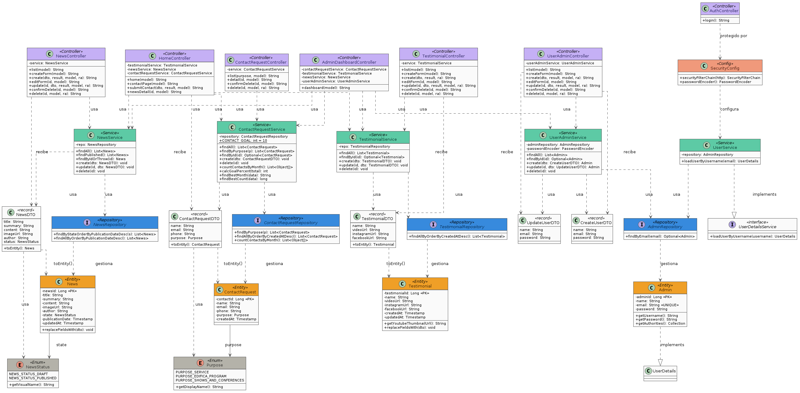

---

## 🗄️ Modelo Entidad / Relación (Base de Datos)

Diagrama de base de datos con las tablas, columnas y relaciones. Generado con draw.io / diagrams.net.

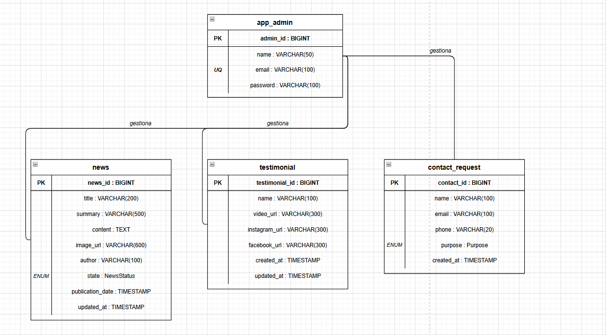

## 🔗 Endpoints Disponibles

31 endpoints MVC (Thymeleaf). Los métodos PUT y DELETE se envían mediante el hidden method filter de Spring MVC (campo oculto `_method` en el formulario).

| Método | Ruta | Descripción | Acceso |
|---|---|---|---|
| GET | `/` | Home pública — testimonios, noticias y form de contacto | Público |
| GET | `/contact` | Formulario de contacto dedicado | Público |
| POST | `/contact` | Enviar solicitud de contacto (PRG pattern, redirect con `?success`) | Público |
| GET | `/noticias/{id}` | Detalle público de una noticia | Público |
| GET | `/login` | Formulario de inicio de sesión | Público |
| GET/POST | `/error` | Manejo de errores HTTP (404, 403, 500) — `CustomErrorController` | Público |
| GET | `/admin` | Dashboard: métricas, gráfica mensual y últimas 5 solicitudes | Admin |
| GET | `/admin/contacts` | Listar solicitudes con filtro opcional por `?purpose=` | Admin |
| GET | `/admin/contacts/{id}` | Ver detalle de una solicitud | Admin |
| GET | `/admin/contacts/delete/{id}` | Confirmar eliminación de solicitud | Admin |
| DELETE | `/admin/contacts/{id}` | Eliminar solicitud | Admin |
| GET | `/admin/news` | Listar todas las noticias | Admin |
| GET | `/admin/news/create` | Formulario para crear noticia | Admin |
| POST | `/admin/news` | Guardar nueva noticia | Admin |
| GET | `/admin/news/edit/{id}` | Formulario para editar noticia | Admin |
| PUT | `/admin/news/{id}` | Actualizar noticia existente | Admin |
| GET | `/admin/news/delete/{id}` | Confirmar eliminación de noticia | Admin |
| DELETE | `/admin/news/{id}` | Eliminar noticia | Admin |
| GET | `/admin/testimonials` | Listar todos los testimonios | Admin |
| GET | `/admin/testimonials/create` | Formulario para crear testimonio | Admin |
| POST | `/admin/testimonials` | Guardar nuevo testimonio | Admin |
| GET | `/admin/testimonials/edit/{id}` | Formulario para editar testimonio | Admin |
| PUT | `/admin/testimonials/{id}` | Actualizar testimonio existente | Admin |
| GET | `/admin/testimonials/delete/{id}` | Confirmar eliminación de testimonio | Admin |
| DELETE | `/admin/testimonials/{id}` | Eliminar testimonio | Admin |
| GET | `/admin/users` | Listar administradores | Admin |
| GET | `/admin/users/create` | Formulario para crear administrador | Admin |
| POST | `/admin/users` | Guardar nuevo administrador | Admin |
| GET | `/admin/users/edit/{id}` | Formulario para editar administrador | Admin |
| PUT | `/admin/users/{id}` | Actualizar administrador existente | Admin |
| GET | `/admin/users/delete/{id}` | Confirmar eliminación de administrador | Admin |
| DELETE | `/admin/users/{id}` | Eliminar administrador | Admin |

---

## 🛠️ Stack de Tecnologías

| Categoría | Tecnología | Detalle |
|---|---|---|
| Lenguaje | Java 21 | LTS — JDK 21 (eclipse-temurin en Docker) |
| Framework | Spring Boot 4.0.5 | Plataforma base del proyecto |
| Web | Spring Web MVC | Controllers, Thymeleaf views, hidden method filter |
| Persistencia | Spring Data JPA + Hibernate | ORM + repositorios, DDL auto=update |
| Seguridad | Spring Security | Form login, BCryptPasswordEncoder, rutas protegidas |
| Validación | Spring Validation (Jakarta) | @NotBlank, @Email, @NotNull + BindingResult |
| Base de datos | PostgreSQL 16 | Producción — DB: `latinoamerica_comparte_integrador` |
| Base de datos test | H2 (runtime) | Base de datos en memoria para pruebas |
| Vista | Thymeleaf | Motor de plantillas del lado servidor |
| CSS | Tailwind CSS (CDN) | Utilidades CSS sin compilar |
| Gráficas | Chart.js 4.x | Gráfica de líneas de contactos por mes en el dashboard |
| Contenedores | Docker (multi-stage) | `gradle:8.7-jdk21` build → `eclipse-temurin:21-jre-alpine` runtime |
| Build | Gradle 8.7 | Wrapper incluido en el repositorio (`gradlew` / `gradlew.bat`) |
| Dev | Spring Boot DevTools | Recarga automática en desarrollo |

### Dependencias principales (`build.gradle`)

```groovy
dependencies {
    implementation 'org.springframework.boot:spring-boot-starter-web'
    implementation 'org.springframework.boot:spring-boot-starter-thymeleaf'
    implementation 'org.springframework.boot:spring-boot-starter-data-jpa'
    implementation 'org.springframework.boot:spring-boot-starter-security'
    implementation 'org.springframework.boot:spring-boot-starter-validation'
    runtimeOnly 'org.postgresql:postgresql'
    runtimeOnly 'com.h2database:h2'
    developmentOnly 'org.springframework.boot:spring-boot-devtools'
}
```

---

## 📸 Capturas UI/UX

### Vista Pública — Home (`/`)
Página principal con sección de testimonios (miniaturas automáticas de YouTube), noticias publicadas en tarjetas, contadores animados y formulario de contacto. Diseño responsivo con Tailwind CSS, navbar fijo y menú hamburguesa en móvil.


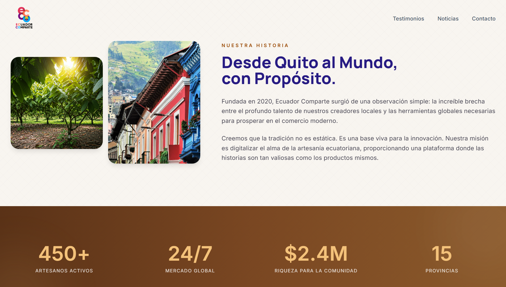
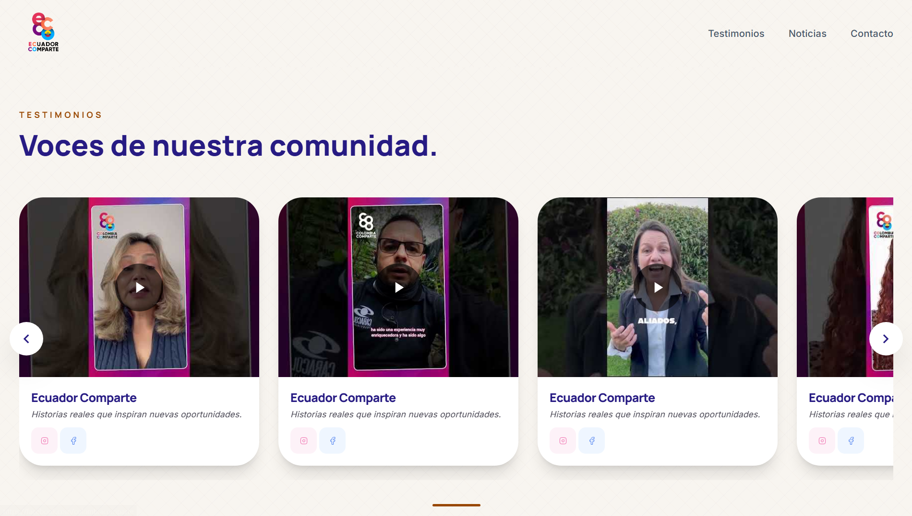
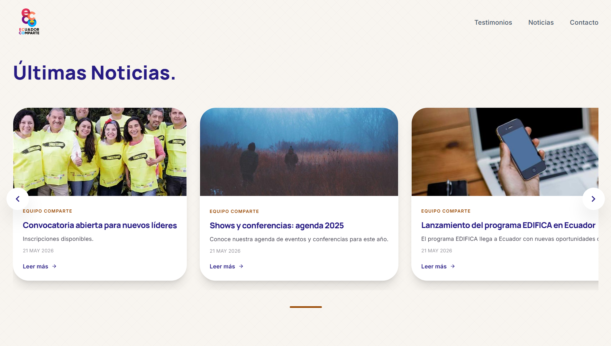
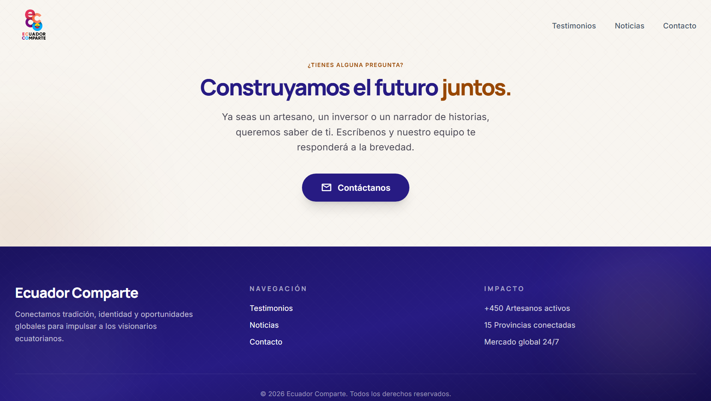

### Vista Pública — Formulario de Contacto (`/contact`)
Formulario con campos nombre, correo, teléfono y propósito (Servicio, Programa EDIFICA, Shows y conferencias). Incluye validación en tiempo real y mensaje de éxito tras el envío (PRG pattern).

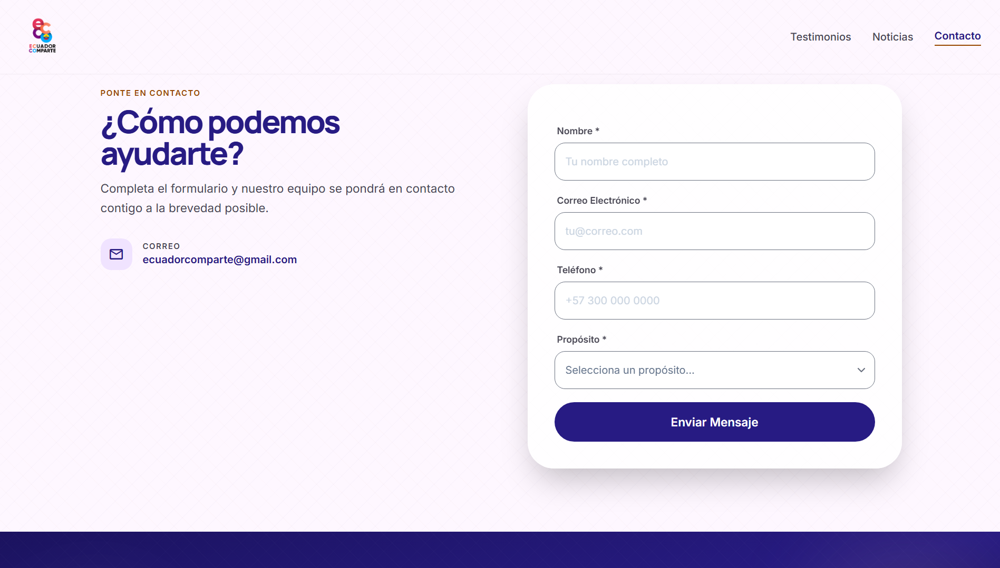

### Panel Admin — Dashboard (`/admin`)
Tarjetas con conteos de testimonios, noticias, solicitudes y administradores. Gráfica de líneas mensual (Chart.js), indicadores de porcentaje de noticias publicadas, meta mensual de contactos y tabla de las últimas 5 solicitudes.

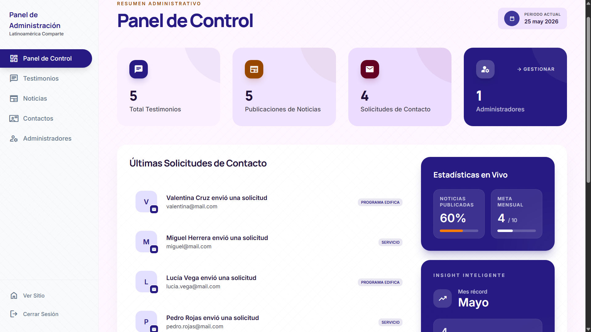
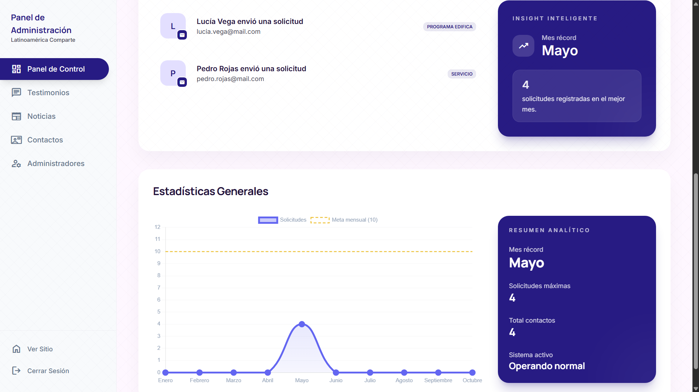

### Panel Admin — Gestión de Noticias (`/admin/news`)
Lista todas las noticias con estado (Publicado/Borrador) y fecha. Permite crear, editar y eliminar noticias con formulario de previsualización en tiempo real. Las noticias en Borrador no son visibles en el home público.

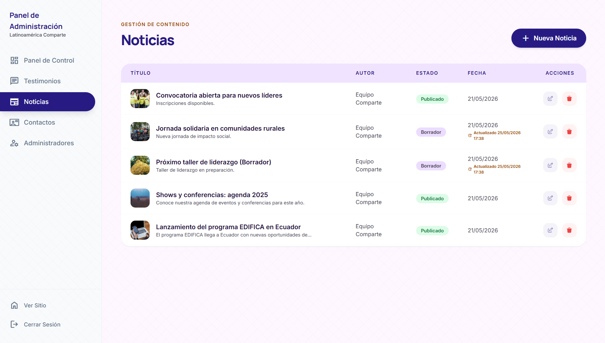
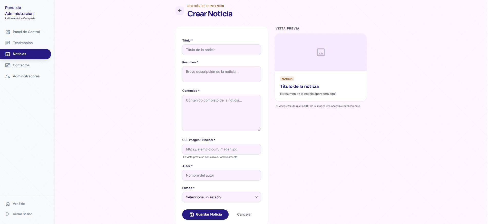
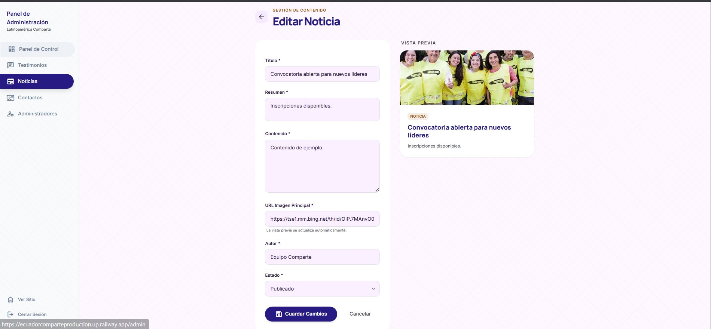
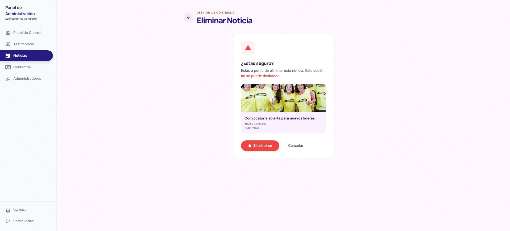

### Panel Admin — Gestión de Testimonios (`/admin/testimonials`)
Muestra testimonios con miniatura automática del video de YouTube. Permite crear, editar y eliminar testimonios indicando nombre, URL del video y redes sociales.

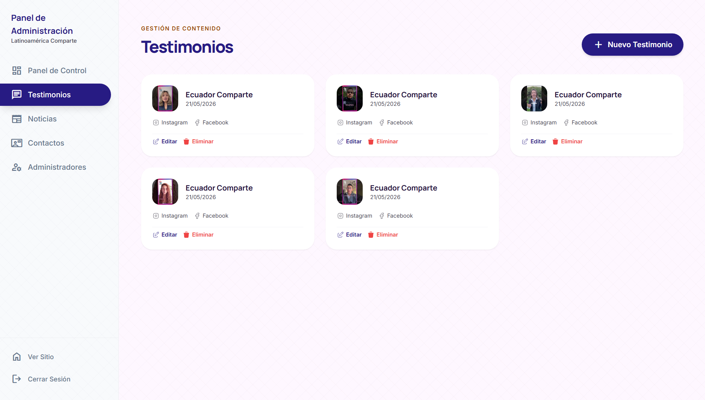
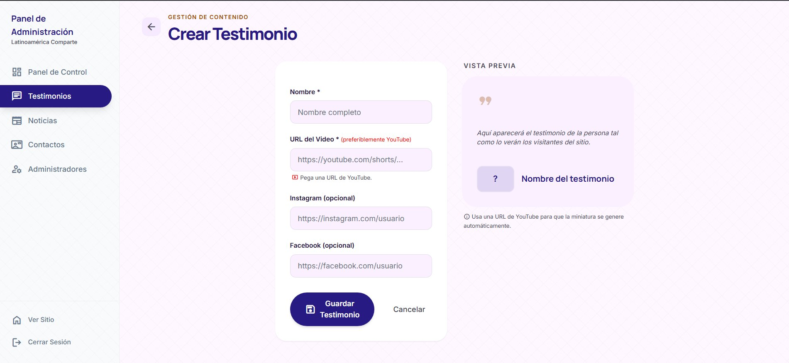
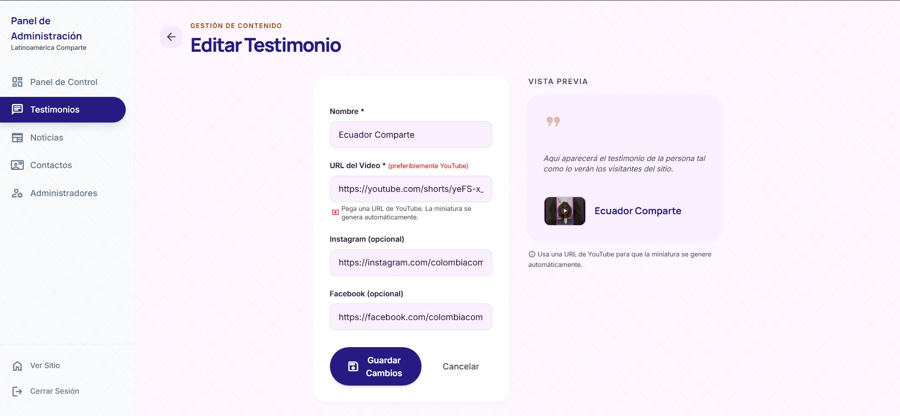
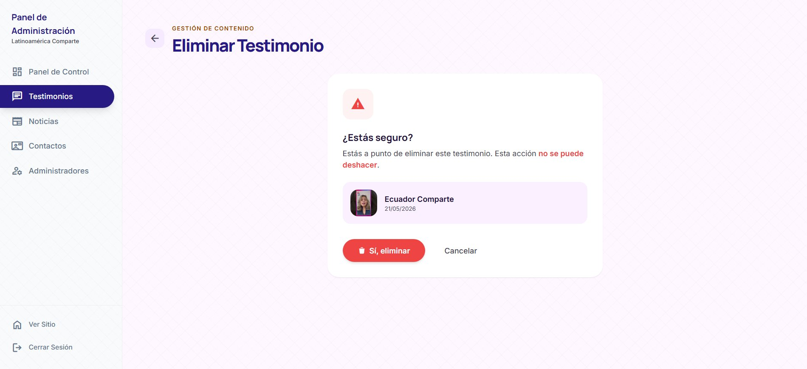

### Panel Admin — Solicitudes de Contacto (`/admin/contacts`)
Lista de solicitudes ordenadas de más reciente a más antigua con filtro por propósito. Permite ver el detalle completo de cada solicitud con filas expandibles y eliminarlas.

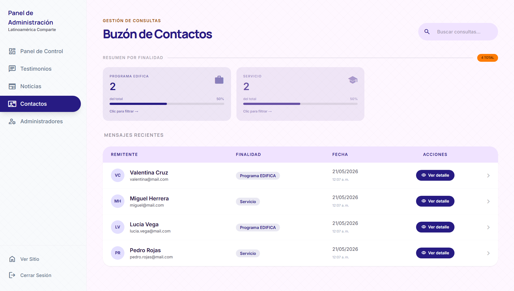
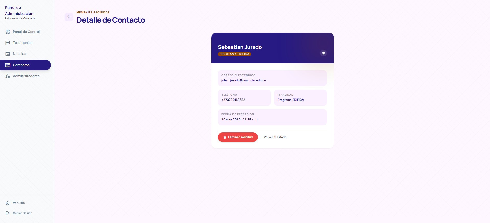
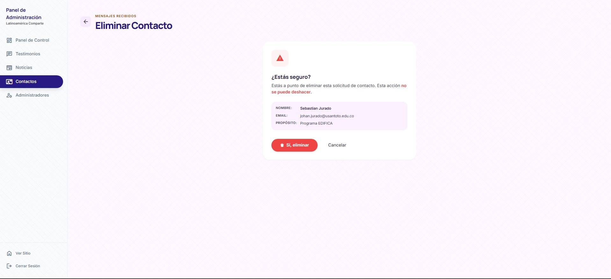

---

## ⚡ Retos Encontrados y Aprendizajes

### Retos técnicos

**1. Miniaturas automáticas de YouTube en testimonios**
El mayor desafío fue lograr que cada testimonio mostrara automáticamente la imagen de previsualización del video de YouTube sin que el administrador tuviera que subir una imagen manualmente. El problema estaba en que las URLs de YouTube no tienen un formato único: un mismo video puede llegar como `watch?v=`, `youtu.be/`, `shorts/` o `embed/`, y cada formato requiere una extracción diferente del ID. La solución fue implementar el método `getYoutubeThumbnailUrl()` con la anotación `@Transient` directamente en la entidad, de forma que parsea la URL almacenada en cada uno de sus posibles formatos, extrae el ID del video y construye automáticamente la URL del thumbnail de Google. Así el sistema funciona sin importar qué formato de URL pegue el administrador.

**2. Eliminación del enum RoleName y refactorización del modelo de seguridad**
Al inicio del proyecto la arquitectura de seguridad incluía un enum `RoleName` con el valor `ADMINISTRADOR`, siguiendo el patrón clásico de Spring Security con tabla de roles. Al avanzar en el desarrollo nos dimos cuenta de que el sistema solo tiene un tipo de usuario (el administrador), por lo que mantener esa estructura generaba complejidad innecesaria: una entidad `Role`, un `RoleRepository`, el enum, y JOINs en cada petición autenticada. El reto fue eliminar todo eso de forma limpia sin romper la autenticación. Se refactorizó la entidad `Admin` para que implementara `UserDetails` directamente y retornara `getAuthorities()` vacío, y el `SecurityConfig` pasó de usar `.hasAuthority()` a `.authenticated()`. El proceso requirió revisar y modificar cada clase que referenciaba `RoleName` para garantizar que nada quedara roto.

**3. Optimización de animaciones pesadas en el frontend**
El home público incluye varias animaciones: un efecto parallax en el hero, contadores numéricos animados, un carrusel de testimonios y otro de noticias, además de un menú hamburguesa responsivo. En las primeras versiones estas animaciones hacían el proyecto notablemente lento, especialmente en dispositivos de gama media. El reto fue optimizarlas sin eliminarlas. La solución fue usar `IntersectionObserver` para que los contadores y animaciones solo se activen cuando el elemento entra en el viewport, evitando cálculos innecesarios en elementos que el usuario aún no ve. Adicionalmente se reemplazaron algunas animaciones CSS costosas por transiciones más livianas, logrando una experiencia fluida sin sacrificar el diseño.

### Aprendizajes técnicos

A lo largo del desarrollo de este proyecto y la asignatura se consolidaron aprendizajes clave:

- **Arquitectura MVC real:** La separación estricta de capas (Controller → Service → Repository) no es solo teoría; se evidencia en la mantenibilidad cuando se refactoriza el modelo de seguridad sin tocar los controladores de negocio.
- **Spring Security como capa transversal:** Entender que la seguridad no es un módulo aislado sino una capa que intercepta cada petición HTTP fue un cambio de perspectiva importante, especialmente al configurar `SecurityFilterChain`.
- **JPA y el ciclo de vida de entidades:** Las anotaciones `@PrePersist` y `@PreUpdate` permiten automatizar auditoría de fechas sin código repetitivo en los servicios.
- **JavaScript nativo vs. frameworks:** Implementar funcionalidades como `IntersectionObserver`, el parallax del hero y los contadores animados con Vanilla JS demostró que muchas interacciones modernas no requieren dependencias externas.
- **Docker y despliegue:** La construcción multi-stage en Docker es una práctica profesional real que reduce dramáticamente el tamaño de la imagen final al separar el entorno de compilación del de ejecución.

---
